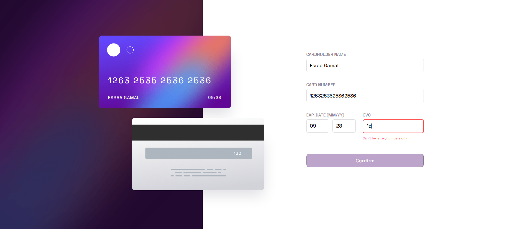
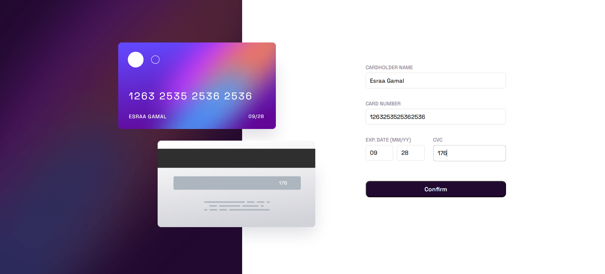

# Interactive-Credit-Card :credit_card:

This project is a dynamic credit card form that provides real-time validation and display of card details. It ensures that users input correct and formatted information by validating the cardholder's name, card number, expiration date, and CVC. As users fill out the form, the card details are updated instantly on a mock card image. The form includes validations for correct formats and input ranges, enhancing user experience and data accuracy.

## Screenshots

---

---

---

---

---
## Usage

- Open the `index.html` file in a web browser.
- Enter the cardholder name, card number, expiration date (MM/YY), and CVC in the form fields.
- The card details will be dynamically displayed on the card image as you type.
- Click the "Confirm" button to submit the form.
- Upon successful submission, a thank you message will be displayed.

## JavaScript Functionality

The project includes the following JavaScript functions for real-time input validation and display:

- **showName()**: Displays the cardholder name in uppercase on the card image.
- **checkName()**: Validates the cardholder name format.
- **showCardNum()**: Formats and displays the card number on the card image.
- **checkNum()**: Validates the card number format.
- **showCvc()**: Displays the CVC number on the card image.
- **checkCvc()**: Validates the CVC number format.
- **showDate()**: Formats and displays the expiration date on the card image.
- **checkMonth()**: Validates the month input.
- **checkYear()**: Validates the year input.
- **checkDate()**: Validates the expiration date.
- **isEnabled()**: Enables the "Confirm" button if all inputs are valid.
- **showThankU()**: Displays a thank you message upon successful form submission.

## Contact

- GitHub: [Esraa-GamalH](https://github.com/Esraa-GamalH)
- Email: esr.gamal@nu.edu.eg

